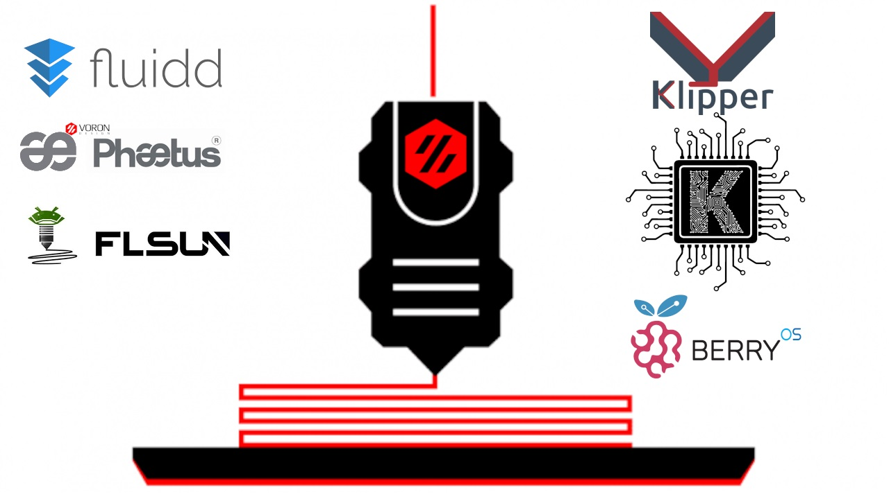

# Klipper_FLSUN_Q5
Config and calibration Printer£D Delta FLSun Q5

################### HW MOD ####################
- Phaetus Dragon Voron HotEnd HF
- MKS Robin Nano v1.2 + 4x BigTrhhTech 2208
- Raspberry Pi Zero 2 W 
- Display TFT 3.5"
- New EFFECTOR-Block (STL)
- FAN Noctua 40x40 
- Led-Strip in towers 2835 24v
- RaspberryCam FullHD

################### SW MOD #####################
- Klipper v0.10.0-184
- Fluidd  v1.16.2
- Moonraker v0.7.1-243
- KlipperScreen v0.2.0-10

############### Install by KIAUH ##############
https://github.com/th33xitus/kiauh
###############################################

Calibration FLSUN Q5:

PREREQUISITES:
# BEFORE :
- Install SW [Klipper + Fluidd + Moonraker in RaspberryDistro]
- Calibrating the DeltaPrint-Geometry, carry out a correct calibration of the extruder!!! 

STEP 1:
- Import "printer [Pre-Calibration].cfg" and rename in "printer.cfg"
- Save and Reboot Klippy

STEP 2:
- Run command "PROBE_CALIBRATE" 
[with sensor installed]
- Fine tuning with Paper method using TESTZ after removing the probe.
[ex. "TESTZ Z=-10" etc.]
- ACCEPT and SAVE_CONFIG

STEP 3:
- Run command "DELTA_CALIBRATE"
- SAVE_CONFIG

STEP 4:
- Print "Calibration Hex 1.STL"
- After printing, keep the bed warm -> GCODE Command: "M140 S60"
- Measure and compile excel-file: 1 - "Klipper Enhanced Delta Calibration.xlsx"
- Command sequence:
-    > DELTA_ANALYZE CENTER......
-    > DELTA_ANALYZE OUTER_DISTS.....   
-    > DELTA_ANALYZE CENTER_PILLAR_WIDTHS.....
-    > DELTA_ANALYZE OUTER_PILLAR_WIDTHS.....
-    > DELTA_ANALYZE CALIBRATE=extended
-    > SAVE_CONFIG

  
STEP 5:
 - Print "Calibration Hex 2.STL"
 - After printing, keep the bed warm -> GCODE Command: "M140 S60"
 - Measure and compile excel-file: 1 - "2 - Calibration_Calculus.xlsx"
 - After filling out the sheet, change the "arm length" parameters at the bottom of the file: printer.cfg

//==========================================================================
//==========================================================================
//==========================================================================

- #*# <---------------------- SAVE_CONFIG ----------------------->
- #*# DO NOT EDIT THIS BLOCK OR BELOW. The contents are auto-generated.
- #*# [stepper_a]
- #*# angle = 210.481232
- #*# arm_length = 217.425939                 ####################### Fine Tuning parameter 
- #*# position_endstop = 218.724820
- #*#
- #*# [stepper_b]
- #*# angle = 330.925002
- #*# arm_length = 216.095900                ####################### Fine Tuning parameter 
- #*# position_endstop = 219.438345
- #*#
- #*# [stepper_c]
- #*# angle = 90.000000
- #*# arm_length = 215.670200               ####################### Fine Tuning parameter 
- #*# position_endstop = 218.763895

//==========================================================================
//==========================================================================
//==========================================================================

